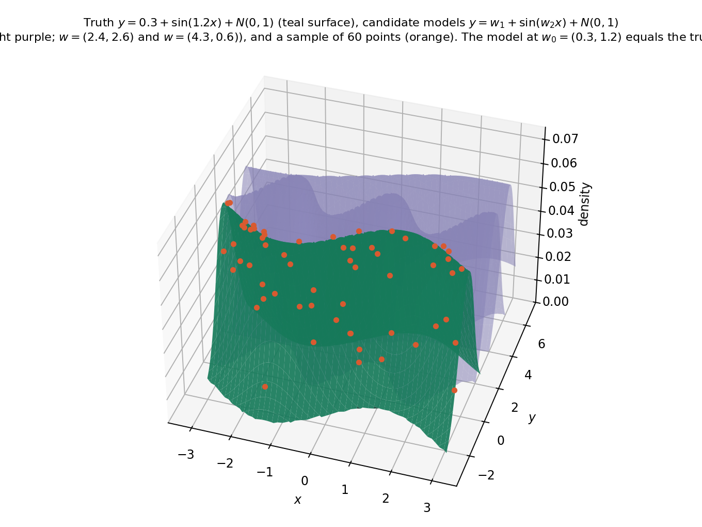
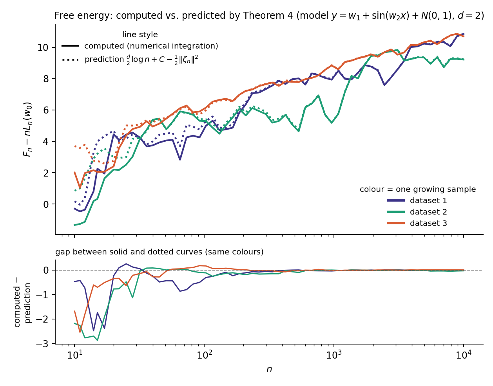
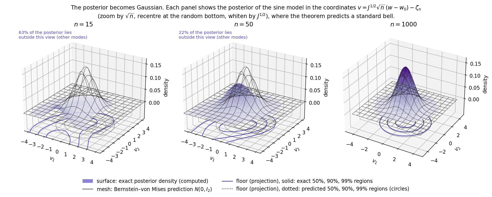
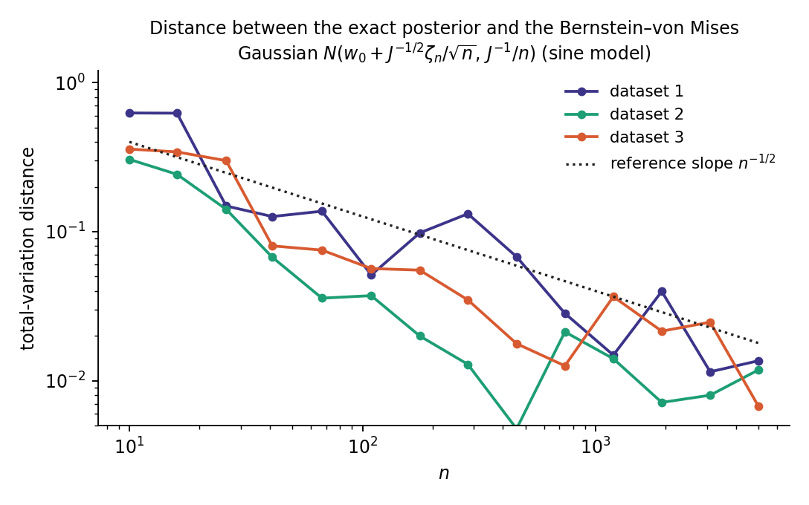
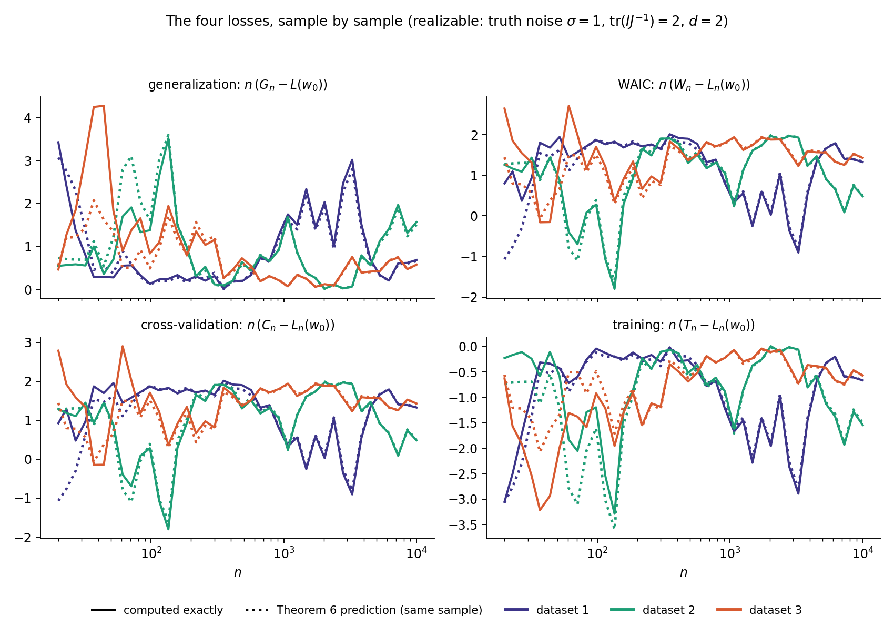
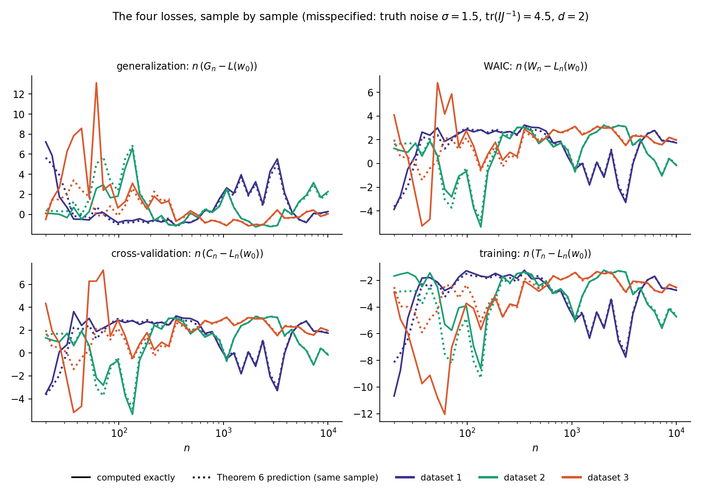

# Analysis of Regular Statistical Models 

## Introduction

We will now analyse the special case when the true distribution is regular for the statistical model. This covers the classical Bayesian statistics. We analyse the regular posterior distribution, and observe the universal structure that is the asymptotic behavior of this distribution. The theorem is akin to central limit theorem, called the Bayesian central limit theorem / Bernstein–von Mises theorem. We also look at the expansions of the observables in this special case. We finally introduce point estimators, and with this, we cover the conventional asymptotic theory and the basic Bayesian treatment. 

This part is more intensive than the previous parts, we are reaching the deep parts of the subject slowly. It is recommended to read the writeup on primer probability and Laplace method before moving ahead. 

Observe below that we have already forgone realizability, a major assumption that need not hold in the singular models of our interest (such as the neural networks we use in practice).

## The 1-D example 

Our first goal is to estimate the partition function, which is a Laplace integral. We will first start with a simpler example, and we will build and motivate our solution from this method. Once the method is understood, it is all about the control. 

Theorem: 

Let $h \in C^3[\alpha, \beta]$ have a unique minimum $w_0$ in the interior. Let $H = h''(w_0) > 0$. Let $\varphi \in C^1$, $\varphi(w_0) > 0$. Then 
$$
I(n) = \int_\alpha^\beta e^{-nh}\varphi dw \sim e^{-nh(w_0)}\varphi(w_0)\sqrt{\frac{2\pi}{nH}}
$$

(Warning: Do not worry about all the analytical assumptions too much just now, you will add them yourself as you go through the proof)

Proof: 

We first centre the integral.
$$
I(n) = e^{-nh(w_0)}\int_\alpha^\beta e^{-n(h(w) - h(w_0))}\varphi(w) dw
$$

Now we do a Taylor expansion of the exponent of the exponential, as Laplace method dictates. Recall that according to the method, we must split the integral into two parts. The first part will be over the set where most of the mass is concentrated (it is clear that this is some neighborhood of $w_0$) and we must show that the second integral is negligible compared to the first one, typically by looking at the fraction. The control is in choosing the right neighborhood. Also recall that we estimate the neighborhood integral by sandwiching. Let us do this now. 

$$
h(w) - h(w_0) = \Delta h'(w_0) + \frac{1}{2}h''(w_0)\Delta^2 + \frac{1}{6}h'''(c)\Delta^3
$$

This is the Taylor expansion with the Lagrange remainder. $\Delta = w - w_0$, and $c \in [\alpha, \beta]$, which is the parameter space for this case. 

The idea is here that we really want to be integrating only the first two terms, as we can handle that. So we want the third one to be negligible. Thus we want to naturally choose a neighborhood around $w_0$ of radius $\delta_n$ (dependent on $n$ because we want to zero in on where the mass of the function is as $n$ increases, so we must decrease the neighborhood accordingly), $A = \{w: 0 \leq ||w - w_0|| < \delta_n\}$, and in this set, $||\Delta|| \leq \delta_n$, hence we get the first control that we want: $n \delta_n^3 \to 0$. 

Let us estimate the integral on this set. First of all, observe that the third Taylor term, which we now call $R_n(w)$, satisfies $|R_n(w)| \leq M\delta_n^3$ (Observe that $A$ is compact and the third derivative of $h$ is continuous) On this note, we call the first term and the second term $A_1$ and $A_2$ respectively. 

$$
I_A(n) = e^{-nh(w_0)}\int_Ae^{-nA_1  - nA_2 - nR_n(w)}\varphi(w) dw
$$

Also, since $\varphi$ is $C^1$ on a compact interval, we can write
$$
\varphi(w) = \varphi(w_0) + \varphi'(c)(w - w_0) \leq \varphi(w_0) + a\delta_n
$$
for some constant $a$. 

Hence, we can now sandwich and estimate the integral. 
$$
\exp(-nh(w_0) - nM\delta_n^3)(\varphi(w_0) - a\delta_n)G\leq I_A(n) 
$$
$$
I_A(n)\leq \exp(-nh(w_0) + nM\delta_n^3)(\varphi(w_0) + a\delta_n) G
$$
where $G$ is the leftover integral. 

Since $n\delta_n^3 \to 0$ and $\delta_n \to 0$, the prefactors $e^{\pm nM\delta_n^3}$ tend to $1$ and $\varphi(w_0) \pm a\delta_n$ tend to $\varphi(w_0)$. Dividing the sandwich through, we get, as $n \to \infty$,
$$
\frac{I_A(n)}{\exp(-nh(w_0))\varphi(w_0)G_n} \to 1
$$

Let us calculate the integral and be over with it. Actually, to compute the integral, we would actually have to complete the square and then use the Gaussian integral formula, but we are in good luck since $A_1 = 0$, since $w_0$ is the minimum. But still keep the method in mind, it will come in use later. 

Thus, we can do a simple change of variable to get
$$
G_n = \int_A e^{-nH(w-w_0)^2/2}dw  = \sqrt{\frac{1}{nH}}\int_{-\sqrt{nH}\delta_n}^{\sqrt{nH}\delta_n}e^{-t^2/2}dt
$$

We can choose $\delta_n$ such that $\sqrt{n}\delta_n \to \infty$ as $n \to \infty$ (this is not contradicting the previous control). Hence $G_n \sim \sqrt{\dfrac{2\pi}{nH}}$. 
Hence, our estimate of the integral is 
$$
I_A(n) \sim \exp(-nh(w_0))\varphi(w_0)\sqrt{\dfrac{2\pi}{nH}}
$$

Now we need to show that the second integral is negligible, that is $I_B(n)/I_A(n) \to 0$, where $B = W / A$. 

This involves finding a lower bound for $h(w) - h(w_0)$. This will upper bound our integrand, which is what we want. 

Let us write the Taylor expansion again. 

$$
h(w) - h(w_0) = \frac{1}{2}h''(w_0)\Delta^2 + \frac{1}{6}h'''(c)\Delta^3
$$

The idea is that even though we know that the second order term is positive (assumption), the third order term can be negative, and hence it is not straightforward to lower bound this. However, if we can upper bound the norm of the third order term, we can do this. The idea is that it is less than any given factor of the second order term (say half). 

Claim: For all $w$ with $|\Delta| = |w - w_0| \leq \eta$, for a suitable $\eta > 0$ chosen below,
$$
\left|\frac{1}{6}h'''(c) \Delta^3\right| \leq \frac{1}{4}h''(w_0)\Delta^2
$$

 The idea is that we split $B$ into two parts, $B_1 = \{w: \delta_n\leq ||w - w_0|| \leq \eta\}$ and $B_2 = B / B_1$. 

Let us analyse on $B_1$ now. Let $M$ bound $|h'''|$ on $[\alpha, \beta]$. For $|\Delta| \leq \eta$,
$$
\left|\frac{1}{6}h'''(c) \Delta^3\right| \leq \frac{M}{6}|\Delta|^3 \leq \frac{M}{6}\eta\,\Delta^2 \leq \frac{1}{4}H\Delta^2
$$
where the last inequality needs $\dfrac{M\eta}{6} \leq \dfrac{H}{4}$. This gives our reverse engineering choice of $\eta = \dfrac{3H}{2M}$, in which case the claim is true. Hence on $B_1$, $h(w) - h(w_0) \geq \frac{1}{2}H\Delta^2 - \frac{1}{4}H\Delta^2 = \frac{1}{4}H\Delta^2 \geq \frac{1}{4}H\delta_n^2$. 

What happens on $B_2$ with this choice of $\eta$? 

Observe that $B_2$ is a compact set, hence since $h(w)$ is a continuous function and $w_0$ is the unique minimum, for all $w \in B_2$, $h(w) - h(w_0) \geq m_\eta > 0$ where the minimum is achieved. Note that $m_\eta$ depends only on $\eta$, not on $n$, while $\frac{1}{4}h''(w_0)\delta_n^2 \to 0$. Hence for a large enough $n$, $m_\eta \geq \frac{1}{4}h''(w_0)\delta_n^2$, and we have 

$$
h(w) - h(w_0) \geq \frac{1}{4}h''(w_0)\delta_n^2
$$
The same is true for $w \in B_1$ by the previous argument, hence it holds on all of $B$. Now let us bound the integrand. Since we have

$$
I_B(n) = e^{-nh(w_0)}\int_Be^{-n(h(w) - h(w_0))}\varphi(w)dw
$$

we get, 
$$
0 \leq I_B(n) \leq ce^{-nh(w_0)}e^{-\frac{n}{4}H\delta_n^2}
$$

Take the fraction now. For large $n$, we get
$$
\frac{I_B(n)}{I_A(n)} \leq c {e^{-\frac{nH}{4}\delta_n^2}\sqrt{n}}
$$

Hence we want $\dfrac{n\delta_n^2}{\log n} \to \infty$. 

This condition does not contradict the previous conditions. In fact, from all the conditions, and letting $\delta_n = n^{-a}$ (power scaling, natural), we get $a \in (\dfrac{1}{3}, \dfrac{1}{2})$. I will keep the choice $a = \frac{2}{5}$. This allows all the control conditions to work, and the same control is used in the multidimensional case as well. It is important to note it now, as I will simply use this control right from the start and it will all magically work out, but the point is that the interval is forced and all the choices there will work, and it is not really magical. 

## Estimating the Partition Function 

We will now estimate the asymptotics of the normalized partition function. We will be considering the regular case with compact parameter space $W$ in a Euclidean space $\mathbb{R}^d$. 

$$
Z_n^{(0)} = \int e^{-nK_n(w)}\varphi(w)dw
$$

The issue is that we cannot directly Taylor expand this. $h(w) - h(w_0) \geq 0$, but it need not be true $K_n(w) - K_n(w_0) \geq 0$. Hence, something else needs to be done. We need to decompose our function of a distance like function and a fluctuation around that and hope it behaves nicely. But why should we expect that? The fluctuation can have a very weird distribution after all. The central limit theorem comes to the rescue in controlling that, it says that the fluctuation is bounded in large samples. This is the universality principle at rescue, which says that you should expect the fluctuation of $f(X_1, ..., X_n)$ to be bounded if the variables are weakly dependent and $f$ sufficiently smooth. 

So we define the empirical process
$$
\xi_n(w) = \sqrt{n}(K_n(w) - K(w))
$$
This centres the expectation (it is now $0$) and by the multidimensional central limit theorem, this converges in distribution to the Gaussian distribution, hence it is $O_p(1)$, 

We divide our partition function into an integral around a neighborhood (we call that the essential part) and the complement of that (called the non essential part). We will see that decomposition into this process works in trying to estimate the essential part, and in figuring out the non essential part, we will need to modify it more. There, we will perform a simple instance of Hironaka Resolution Theorem. It is important to grasp that idea and why it comes in the first place. We will see what that is about when we get there. 

## Essential Part 

We have 
$$
nK_n(w) = \sqrt{n}\xi_n(w) + nK(w)
$$
We will Taylor expand both terms with Lagrange remainder. I am going to remove terms directly which are $0$, you can check that. Call the Hessian of $K$ at $w_0$ as $J$.

$$
nK(w) = \frac{n}{2}\Delta^tJ\Delta + \frac{n}{6}\nabla^3K(c)[\Delta, \Delta, \Delta]
$$
The first term is $A_1$ the second term is $A_2$. 

$$
\sqrt{n}\xi_n(w) = \sqrt{n}\Delta^t\nabla\xi_n(w_0) + \frac{\sqrt{n}}{2}\Delta^t\nabla^2\xi_n(w_0)\Delta  + \frac{\sqrt{n}}{6}\nabla^3\xi_n(c)[\Delta, \Delta, \Delta]
$$
The first term, second term, and the third term are $A_3, A_4, A_5$ respectively. 

We want to discard all the $o_p(1)$ terms into our remainder function $R_n(w)$ for sandwiching. 

Let us look at $A_2$ first. 
$$
A_2 \;\leq M_2n\delta_n^3
$$
Our choice of $\delta_n$ is predecided, $\delta_n = n^{-2/5}$, so we see that $A_2 \to 0$. We can safely push this into our remainder. 

Now, $A_4$ is a random variable. Let $X_n$ be the norm of the Hessian, which is a random variable. Observe that $\{X_n\} = O_p(1)$
$$
A_4 \leq M_4 a_nX_n \qquad a_n = \sqrt{n}\delta_n^2
$$

Since $a_n \to 0$, $\{X_n\} = O_p(1)$, we have $\{a_nX_n\}$ = $o_p(1)$. 

Hence $A_4$ is $o_p(1)$, and similarly, so is $A_5$, **with one caveat: in $A_5$ the point $c$ is random and depends on $w$, so the pointwise central limit theorem is not enough. We need the uniform bound $\sup_{w \in W}\|\nabla^3\xi_n(w)\| = O_p(1)$, which we assume. Then $|A_5| \leq M_5\sqrt{n}\delta_n^3\sup_{w \in W}\|\nabla^3\xi_n(w)\| = o_p(1)$, since $\sqrt{n}\delta_n^3 \to 0$**.

Hence we write
$$
nK_n(w) = A_1 + A_3 + R_n(w) \qquad R_n(w) = o_p(1)
$$

We will sandwich and estimate the same way we did for the one dimensional Laplace integral. Assume all sufficient smoothness for the bounds. Let $|R_n| \leq \rho_n$ where $\rho_n \to 0$ in probability. Then we have 

$$
e^{-\rho_n}(\varphi(w_0) - a\delta_n)\int e^{-A_1 - A_3}dw \leq Z_n^{(1)} \leq e^{\rho_n}(\varphi(w_0) + a \delta_n)\int e^{-A_1 - A_3}dw
$$
Now all that is left to do is to compute the integral 

$$
G_n = \int e^{-A_1 - A_3}dw
$$
The idea is to complete the square, write the sum of quadratic + linear as a quadratic + constant. And we know how to handle the quadratic for the exponential, and the constant gets handled trivially. 

One can write 
$$
\frac{n}{2}\Delta^tJ\Delta + \sqrt{n}\Delta^t\nabla\xi_n(w_0) = \frac{1}{2}||J^{1/2}u - \zeta_n||^2 - \frac{1}{2}||\zeta_n||^2
$$
where $u = \sqrt{n}(w - w_0)$ and $\zeta_n = -J^{-1/2}b_n$ and $b_n = \nabla \xi_n(w_0)$. 

We first do the change of coordinates from $w$ to $w - w_0$ which does not change the integral as it is just a translation, then from $w - w_0$ to $\sqrt{n}(w - w_0)$ which gives the factor $(\dfrac{1}{\sqrt{n}})^d$ (this is just the determinant of the transition from the latter to the former). 

Now the final transition from $u$ to $v = J^{1/2}u - \zeta_n$ gives the factor $\det(J)^{-1/2}$

Hence, 
$$
G_n = n^{-d/2}\det(J)^{-1/2}e^{||\zeta_n||^2/2} \int_{D_n} e^{-||v||^2/2}dv
$$
where $D_n$ is some ellipsoid. But this is contained in a ball centred around $-\zeta_n$, and it also contains a ball around $-\zeta_n$, and both of them tend to the entire $\mathbb{R}^d$ as $n \to \infty$, in probability. Thus we can adjust the lower bound and the upper bound to have the same integral over $\mathbb{R^d}$ instead, which is just $(\sqrt{2\pi})^d$. Taking $n \to \infty$, we get that the lower bound and the upper bound are the same, and the integral in between is 
$$
Z_n^{(1)} \sim (2\pi)^{d/2}\varphi(w_0)n^{-d/2}\det(J)^{-1/2}e^{||\zeta_n||^2/2}
$$

Now we deal with the non essential part. 

## Non Essential Part 

Now we need to lower bound $nK_n(w)$. Well, we can bound $nK(w)$, but how do we go about $\sqrt{n}\xi_n(w)$? We cannot actually do this, since this fluctuation is $O_p(\sqrt{n})$. We will need to do some sort of normalization here. 

Let us first deal with $nK(w)$ though. We will do it the same way we did the one-dimensional case. The only thing that changes is that this is multidimensional, so the min of the second order term is $\frac{1}{2}\lambda_{min}(J)\delta_n^2$, so we get the lower bound this time as $nK(w) \geq \frac{1}{4}\lambda_{min}n\delta_n^2$. Feel free to do the argument again formally here as an exercise. 

Let us deal with the fluctuation. As discovered, we will need to normalize this, where the normalization factor has to be of order $\sqrt{n}$ with respect to $K(w)$. 

Define the process 
$$
\gamma_n(w) = \frac{\xi_n(w)}{\sqrt{K(w)}} = \frac{\sqrt{n}(K_n(w) - K(w))}{\sqrt{K(w)}}
$$

Claim: $\gamma_n(w) = O_p(1)$

Proof: **We assume that** relatively finite variance holds for the log density ratio function **(this does not follow from regularity alone; it is an extra condition)**: $E_X[f(X, w)^2] \leq c_0 K(w)$ for all $w$. 

Now,
$$
V[\gamma_n(w)] = \frac{V[\xi_n(w)]}{K(w)} = \frac{V_X[f(X, w)]}{K(w)} \leq \frac{E_X[f(X, w)^2]}{K(w)} \leq c_0
$$

Hence, 
$$
P(|\gamma_n(w)| > t) \leq \frac{c_0}{t^2} \implies \gamma_n(w) = O_p(1)
$$
Note that we were able to get this from relatively finite variance, which **we have assumed**. When we move to the more general case, we will **keep** this assumption, and I am not sure why we should assume this to be true. But it will still be a great improvement. 

There are two issues with the definition above though: 

1) In a more general model, $W_0$ is not one point, it is a real analytic set. Hence $f(x, w)$ cannot be treated locally. More precisely, what this means is that the Taylor expansion we have been doing does not work directly, since now the Hessian is degenerate (not positive definite) (this is a heuristic argument). So this definition of the process does not really work anymore. Keep this in mind, we will deal with this formally later. 

2) The second is the fact that the process is not defined at $W_0$ as the denominator is $0$. It may not even be possible to continuously extend our process to $W_0$.

The second issue holds even for our regular model. What is the "resolution" here? The solution is to perform a diffeomorphism of the space, and then extend the function to $w_0$ there. This is the main idea one should keep in mind. We describe the solution formally now. 

Define a diffeomorphism from $\mathbb{R}^d \backslash 0$ to $(0, \infty) \times S^{d-1}$ that takes $w - w_0 \to r\theta$ where $r = ||w - w_0||$ and $\theta = \dfrac{w - w_0}{||w - w_0||}$.
The numerator becomes $rb_n\cdot\theta + O(r^2)$ and $\sqrt{K} = r\sqrt{\theta^tJ\theta/2(1 + O(r))}$. One can check that the limit now exists. 

This is the simplest instance of the Resolution, and the more general case is handled by Hironaka's Resolution Theorem, which deals with both the issues mentioned above. 

By using the inequality $|ab| \leq \dfrac{a^2 + b^2}{2}$, we get (take $a = \sqrt{nK}, b = \gamma_n$)
$$
\frac{1}{2}nK(w) - \frac{1}{2}\Gamma_n^2 \leq nK_n(w) \leq \frac{3}{2}nK(w) + \frac{1}{2}\Gamma_n^2
$$

where $\Gamma_n^2 = \sup_{w \in W} ||\gamma_n(w)||^2$. Observe that even if $X_n = O_p(1)$, $\sup X_n$ need not be $O_p(1)$. Hence, this is an added assumption that $\Gamma_n = O_p(1)$. Also, the existence of $\Gamma_n$ comes from the fact that $\gamma_n(w)$ is a continuous function (we have extended it continuously) on a compact space. 

This finally enables us to sandwich the non essential part of the partition function. 

Using the lower bound $nK_n(w) \geq \frac{1}{2}nK(w) - \frac{1}{2}\Gamma_n^2$, together with $nK(w) \geq \frac{1}{4}\lambda_{min}n\delta_n^2$ on $B$, we get
$$
Z_n^{(2)} \leq e^{\Gamma_n^2/2}\int_B \exp(-\frac{1}{2}nK(w))\varphi(w)dw \leq e^{\Gamma_n^2/2}\exp(-\frac{1}{8}\lambda_{min}n\delta_n^2)\int_B\varphi(w)dw
$$
Now, since $\varphi(w)$ is a density function, the integral over $B$ is less than equal to $1$. 
$$
Z_n^{(2)} \leq e^{\Gamma_n^2/2}\exp(-\frac{1}{8}\lambda_{min}n\delta_n^2)
$$
Since $\Gamma_n = O_p(1)$, the factor $e^{\Gamma_n^2/2}$ is $O_p(1)$, and it does not affect the conclusions below.
This directly gives the following two results, the second one being what we need to show: 
$$
n^kZ_n^{(2)} \to 0 \quad \text{ in probability for every k}

$$
$$
\dfrac{Z_n^{(2)}}{Z_n^{(1)}} \to 0 
$$

Hence the non essential part is negligible, and we have estimated the essential part of the partition function. We are done here. 

We get the asymptotic expansion of the free energy in the regular case now. 

$$
F_n = nL_n(w_0) + F_n^{(0)} \qquad F_n^{(0)} = -\log Z_n^{(0)} = -\log Z_n^{(1)}(1 + \frac{Z_n^{(2)}}{Z_n^{(1)}}) = -\log Z_n^{(1)} + o_p(1)
$$

Finally, to get the formula, we apply the log to our estimate. Hence, 

$$
F_n = nL_n(w_0) + \frac{d}{2}\log n - \frac{d}{2}\log (2\pi) + \frac{1}{2}\log (\det J) - \log\varphi(w_0) - \frac{||\zeta_n||^2}{2} + o_p(1) $$

Let us test out our theory on a regular model.

(Figures generated by Opus 5.5)

*The sine regression model $y = w_1 + \sin(w_2x) + N(0, 1)$: the true model $w_0 = (0.3, 1.2)$ (teal), two other candidate models (purple), and a sample of 60 points (orange).*

*Free energy computed by numerical integration (solid) against the prediction $\frac{d}{2}\log n + C - \frac{1}{2}\|\zeta_n\|^2$ from the expansion above (dotted), for three growing samples. The lower panel shows the gap between the two, which goes to $0$. ("Theorem 4" in the plot title refers to the free energy expansion above.)*

Do note one thing: We cannot make a statement about the expectations yet, we need to show Uniform Integrability for that (recall from the probability primer: convergence in distribution/probability + uniform integrability implies covergence in expectation)

## Asymptotics of the Posterior

First, observe the following: 
$$
E_w[g] = \frac{Z_n(g)}{Z_n(1)} \quad Z_n(g) := \int_W g(w)e^{-nK_n(w)}\varphi(w)dw
$$

From now on, $g$ is a function of the normalized coordinate $v = J^{1/2}\sqrt{n}(w - w_0) - \zeta_n$, so $g(v)$ means $g$ evaluated at $v(w)$. Let us now estimate $Z_n^{(1)}(g)$. Not a lot changes from the way we estimated $Z_n^{(1)}(1)$. Do the same completing the square and change of variables to get some $c_n$ which has the Jacobian factors and the $\zeta_n$ term. But this time, we cannot directly take out the remainder term and the $\varphi$ term, since $g$ can also be negative. 

Let $G(v) = \exp\left({-\dfrac{||v||^2}{2}}\right)$. Our idea is that we hope for the leftover to be close to $\varphi(w_0)\int_{\mathbb{R}^d}g(v)G(v)dv$, so we look at the difference as the error term and show that it goes to $0$. We decompose the error terms into three parts: 

$$
E_1 = \int_{D_n}gG(e^{-R_n} - 1)\varphi(v)dv
$$

$$
E_2 = \int_{D_n}gG(\varphi(v) - \varphi(w_0))dv
$$

$$
E_3 = \varphi(w_0)\left(\int_{D_n}gGdv - \int_{\mathbb{R}^d}gGdv \right)
$$

Whenever $gG$ is integrable (special case: $g$ is a polynomial), it is easy to see that each of these terms are bounded by terms that go to $0$ in probability. 

Hence, 
$$
Z_n^{(1)}(g) = e^{||\zeta_n||^2/2}\varphi(w_0)n^{-d/2}(\det J)^{-1/2}\left( \int_{\mathbb{R}^d}gGdv + o_p(1) \right)
$$

When $g$ is a continuous bounded function, $Z_n^{(2)}(g) \leq \sup|g| Z_n^{(2)}(1)$ hence this is negligible, and we have the estimate we want. The other special case is for $g$ polynomial, when the result still holds, since $n^kZ_n^{(2)} \to 0$ for every $k$. 

Let $V \sim N(0, I_d)$. Then

Claim:
$$
E_w[g(v)] \to E[g(V)] \quad \text{in probability.}
$$

This is simple. 
$$
E_w[g(v)] = \frac{Z_n(g)}{Z_n(1)} = \frac{Z_n^{(1)}(g)/Z_n^{(1) } + o_p(1)}{1 + o_p(1)} \to \frac{\int gG}{\int G} = E[g(V)]
$$

In particular, $E_w[v] \to 0,$ and $E_w[vv^t] \to I_d$. 

Changing back to the original coordinates, through the two formulas (Observe that $\zeta_n$ can be pulled out under $E_w[\cdot]$)
$$
v = J^{1/2}u - \zeta_n\\
u = \sqrt{n}(w - w_0)
$$

We get the following: 
$$
\sqrt{n}E_w[w - w_0] - J^{-1/2}\zeta_n \to 0 \\
nE_w[(w - w_0)(w - w_0)^t] - (J^{-1} + J^{-1/2}\zeta_n\zeta_n^tJ^{-1/2}) \to 0 \\
n \text{ Cov}_w(w) \to J^{-1}
$$

Now note that this claim is true about every bounded continuous function $g$. This is  just the definition of convergence in distribution though! 
Hence the posterior law of $v$ converges to $N(0, I_d)$ in probability (probability based on the sample, that is what the posterior depends on). 

Translating back to $w$, we get 
$$
\text{posterior of w} \approx N(w_0 + \frac{J^{-1/2}\zeta_n}{\sqrt{n}}, \frac{J^{-1}}{n})
$$

(Figures generated by Opus 5.5)

*The exact posterior in the coordinates $v = J^{1/2}\sqrt{n}(w - w_0) - \zeta_n$ (surface) against the Bernstein–von Mises prediction $N(0, I_2)$ (mesh), at $n = 15, 50, 1000$. For small $n$ the posterior still puts mass on other modes; by $n = 1000$ it matches the standard bell.*

*Total-variation distance between the exact posterior and the Gaussian $N(w_0 + J^{-1/2}\zeta_n/\sqrt{n}, J^{-1}/n)$, for three datasets. It shrinks roughly like $n^{-1/2}$.*

## Regular Asymptotics of our Observables 

We now derive the asymptotic behaviors of the 4 observables we have defined. 

Now, recall the theorem from the last part. I recall it here ($W_n$ has the same expansion as $C_n$)

$$
G_n = L(w_0) + E_w[K(w)] - \frac{1}{2}E_XV_w[f(X, w)] + o_p(\frac{1}{n}) \\
C_n = L_n(w_0) + E_w[K_n(w)] + \frac{1}{2n}\sum_{i = 1}^nV_w[f(X_i, w)] + o_p(\frac{1}{n}) \\
T_n = L_n(w_0) + E_w[K_n(w)] - \frac{1}{2n}\sum_{i = 1}^nV_w[f(X_i, w)] + o_p(\frac{1}{n})
$$

We just now need to estimate the terms. Let $H = \nabla^2f(x, w_0)$

$$
f(x, w) = \Delta^t\nabla f(x, w_0) + \frac{1}{2}tr(H\Delta\Delta^t) + O(||\Delta||^3)
$$
Now, $E_w||u||^3 \leq (E_w||u||^4)^{3/4}$ (By Hölder), now since this is a polynomial, by the previous part we have that $E_w$ of the remainder is $o_p(1/n)$. Hence,
$$
E_w[f(x, w)] = E_w[\Delta]^t \nabla f(x, w_0) + \frac{1}{2}tr(HE_w[\Delta\Delta^t]) + o_p(\frac{1}{n})
$$
By using our posterior average bounds, 

$$
E_w[f(x, w)] = \left(\frac{1}{\sqrt{n}}J^{-1/2}\zeta_n\right)^t\nabla f(x, w_0) + \frac{1}{2n}tr(H(J^{-1} + J^{-1/2}\zeta_n\zeta_n^tJ^{-1/2})) + o_p(\frac{1}{n})
$$

**For a single fixed $x$, the error coming from $E_w[\Delta]$ in the first term is only $o_p(1/\sqrt{n})$. It becomes $o_p(1/n)$ once we average over $x$, because $E_X[\nabla f(X, w_0)] = \nabla K(w_0) = 0$ and $\frac{1}{n}\sum_{i = 1}^n\nabla f(X_i, w_0) = O_p(1/\sqrt{n})$. Only these averages enter $G_n$, $T_n$ and $C_n$, so the expansions below are unaffected.**

We also have that 
$$
E_w[f(x, w)^2] = E_w[(\Delta^t\nabla f(x, w_0))^2] + o_p(\frac{1}{n})
$$

$$
 = tr(E_w[\Delta\Delta^t]\nabla f(x, w_0)\nabla f(x, w_0)^t) + o_p(\frac{1}{n})
$$
We can again substitute in our posterior averages. 

Using the following substitutions: 
$$
\frac{1}{\sqrt{n}}\sum_{i = 1}^n \nabla f(X_i, w_0) = -J^{1/2}\zeta_n
$$

$$
\frac{1}{n}\sum_{i = 1}^n\nabla^2f(X_i, w_0) = J + o_p(1)

$$
$$
E_X[\nabla^2f(X, w_0)] = J
$$

**Here $I = E_X[\nabla f(X, w_0)\nabla f(X, w_0)^t]$, and $\frac{1}{n}\sum_{i = 1}^n\nabla f(X_i, w_0)\nabla f(X_i, w_0)^t \to I$ in probability.**

We get the following asymptotes for the losses (it is an exercise to substitute them and check). 

$$
G_n = L(w_0) + \frac{d + ||\zeta_n||^2 - tr(IJ^{-1})}{2n} + o_p(\frac{1}{n}) \\
$$
$$
T_n = L_n(w_0) + \frac{d - ||\zeta_n||^2 - tr(IJ^{-1})}{2n} + o_p(\frac{1}{n})
$$
$$
C_n = L_n(w_0) + \frac{d - ||\zeta_n||^2 + tr(IJ^{-1})}{2n} + o_p(\frac{1}{n})
$$

And $W_n$ has the same expansion as $C_n$.

**The distribution of $\zeta_n$.** **By the central limit theorem, $b_n = \frac{1}{\sqrt{n}}\sum_{i = 1}^n\nabla f(X_i, w_0)$ converges in distribution to $N(0, I)$ (the mean is $0$ because $\nabla K(w_0) = 0$). Hence $\zeta_n = -J^{-1/2}b_n$ converges in distribution to $N(0, J^{-1/2}IJ^{-1/2})$, and $E\|\zeta_n\|^2 \to \mathrm{tr}(IJ^{-1})$. In the realizable case $I = J$, so $\|\zeta_n\|^2$ is asymptotically $\chi^2_d$.**

**Taking expectations of the expansions above (assuming uniform integrability, see the exercise below), and using $E[L_n(w_0)] = L(w_0)$:**
$$
\begin{aligned}
E[G_n] &= L(w_0) + \frac{d}{2n} + o(\frac{1}{n}) \\
E[C_n] &= L(w_0) + \frac{d}{2n} + o(\frac{1}{n}) \\
E[T_n] &= L(w_0) + \frac{d - 2\,\mathrm{tr}(IJ^{-1})}{2n} + o(\frac{1}{n})
\end{aligned}
$$
**So cross-validation (and WAIC) is an asymptotically unbiased estimator of the generalization loss, while the training loss underestimates it by $\mathrm{tr}(IJ^{-1})/n$ on average. This equals $d/n$ only in the realizable case, which is why a fixed correction of $d$ (as in AIC) fails under misspecification.** 

### Checking the losses on the sine model

Let us check if the theory actually works. We are dealing with the sine regression problem here. The figures are generated by Opus 5.5. 

*Realizable case (true noise $\sigma = 1$, so $\mathrm{tr}(IJ^{-1}) = d = 2$). Solid: computed exactly. Dotted: the predicted expansions above ("Theorem 6" in the legend), on the same sample. Each loss locks onto its prediction as $n$ grows. Note that on each dataset generalization and cross-validation move in opposite directions: they carry $+\|\zeta_n\|^2$ and $-\|\zeta_n\|^2$ respectively.*

We now check the non realizable case.  The best parameter is still $w_0 = (0.3, 1.2)$, but now $I = \sigma^2 J$, so $\mathrm{tr}(IJ^{-1}) = 4.5 \neq d$.

*Misspecified case (true noise $\sigma = 1.5$, $\mathrm{tr}(IJ^{-1}) = 4.5$). The predictions still hold. The training loss is now biased by $\mathrm{tr}(IJ^{-1})/n$ rather than $d/n$, so a fixed correction of $d$ (as in AIC) would be wrong, while cross-validation and WAIC pick up the right amount from the data.*

Exercise: I am not going to prove uniform integrability (UI), as the argument does not seem sufficiently instructive and reusable. Assume it and derive the asymptotes of the expectations of the observables.

## Point Estimators 

There are other statistical estimation methods when the true distribution is regular for the statistical model, that are not entirely Bayesian in nature. 

$$
w_{ML} = \argmax_{w \in W} \prod_{i=1}^np(x_i|w) \quad \text{Maximum Likelihood } \\
w_{MAP} = \argmax_{w \in W}\varphi(w)\prod_{i = 1}^np(x_i|w) \quad  \text{Maximum A Posteriori} \\
w_{PM} = E_w[w] \quad  \text{Posterior Mean Estimator}
$$

Remember the completion of the square that we did for $nK_n$. The minimizer, which is $w_{ML}$ satisfies $w \approx w_0 + \frac{J^{-1/2}\zeta_n}{\sqrt{n}}$. 

More precisely (prove this yourself), 
$$
w_{ML} = w_0 + \frac{J^{-1/2}\zeta_n}{\sqrt{n}} + o_p(\frac{1}{\sqrt{n}})
$$
and the other two estimators also have the same expansion up to this order. 

Definition: 
The generalization and training losses of the maximum likelihood method are defined by 
$$
G_n(ML) = L(w_{ML}) \\
T_n(ML) = L_n(w_{ML})
$$

We can now find the asymptotes by just the same standard method. 

$$
G_n(ML) = L(w_0) + \frac{||\zeta_n||^2}{2n} + o_p(\frac{1}{n}) \\
T_n(ML) = L_n(w_0) - \frac{||\zeta_n||^2}{2n} + o_p(\frac{1}{n})
$$

## Further Steps 

We will generalize the model from the regularity assumption. Thus we will introduce the RLCT and its interpretation. 

